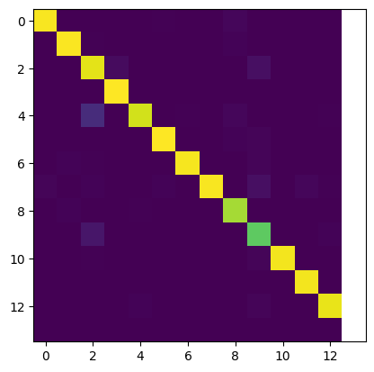

# NLP Assignment 1 - POS Tagging
## Harshavardhan P - 2021111003

 
> All evaluations were done on FNN models trained on 20 epochs and RNN models trained on 10 epochs.

## Modelling Assumptions

- All the data inputs were converted to embeddings using a dicitonary of word to embeddings, and also stored as part of the model instead of learning the embeddings as part of the training process. This was assumed and done so since the question in assignment had mentioned that the model would take in embeddings as input and output tags.
- The outputs are produced as vectors of length equal to the number of tags, and the tag with the highest value is chosen as the output tag (softmax function is used to convert the output to probabilities). So the model is trained with one hot encoding for outputs and not with the actual tags. The model was tried out with power set encoding, but the performance was not as good as one hot encoding, or did not show much change.

## FNN Metrics

Confusion Matrix for FNN (best performing model):

Best 3 Models:

1. Model 1:
    - span: 1
    - hidden: [100, 100]
    - optimizer: Adam
    - learning rate: 0.0001
    - weight decay: 0.0001
    - loss: BCELoss
    - activation: ReLU
    - epochs: 30
    - batch size: 64
    - embedding: glove-wiki-gigaword-200

    - accuracy_dev: 0.9862
    - precision_dev: 0.9861
    - recall_dev: 0.9862
    - f1_dev: 0.9860
    - accuracy_test: 0.9862
    - precision_test: 0.9822
    - recall_test: 0.9861
    - f1_test: 0.9871

2. Model 2:
    - span: 1
    - hidden: [100, 100]
    - optimizer: Adam
    - learning rate: 0.0001
    - weight decay: 0.0001
    - loss: BCELoss
    - activation: ReLU
    - epochs: 30
    - batch size: 64
    - embedding: glove-wiki-gigaword-100

    - accuracy_dev: 0.9822
    - precision_dev: 0.9820
    - recall_dev: 0.9822
    - f1_dev: 0.9820

3. Model 3:
    - span: 2
    - hidden: [100, 100]
    - optimizer: Adam
    - learning rate: 0.0001
    - weight decay: 0.0001
    - loss: BCELoss
    - activation: ReLU
    - epochs: 30
    - batch size: 64
    - embedding: glove-wiki-gigaword-100

    - accuracy_dev: 0.9813
    - precision_dev: 0.9812
    - recall_dev: 0.9813
    - f1_dev: 0.9808

## RNN Metrics

Confusion Matrix for RNN (best performing model):

Best 3 Models:

1. Model 1:
    - hidden: 100
    - optimizer: Adam
    - learning rate: 0.0001
    - weight decay: 0.0001
    - loss: BCELoss
    - activation: ReLU
    - epochs: 20
    - batch size: 64
    - embedding: glove-wiki-gigaword-200

    - accuracy_dev: 0.9602
    - precision_dev: 0.9589
    - recall_dev: 0.9567
    - f1_dev: 0.9578
    - accuracy_test: 0.9601
    - precision_test: 0.9594
    - recall_test: 0.9539
    - f1_test: 0.9566

2. Model 2:
    - hidden: 50
    - optimizer: Adam
    - learning rate: 0.0001
    - weight decay: 0.0001
    - loss: BCELoss
    - activation: ReLU
    - epochs: 20
    - batch size: 64
    - embedding: glove-wiki-gigaword-200

    - accuracy_dev: 0.9589
    - precision_dev: 0.9581
    - recall_dev: 0.9567
    - f1_dev: 0.9573

3. Model 3:
    - hidden: 50
    - optimizer: Adam
    - learning rate: 0.0001
    - weight decay: 0.0001
    - loss: BCELoss
    - activation: ReLU
    - epochs: 20
    - batch size: 64
    - embedding: glove-wiki-gigaword-100

    - accuracy_dev: 0.9571
    - precision_dev: 0.9569
    - recall_dev: 0.9567
    - f1_dev: 0.9563

## Hyperparameter Tuning
 
Here are some of the experiments logged for reference:
https://wandb.ai/rockingharsha71/fnn_pos_tagger
https://wandb.ai/rockingharsha71/RNN_POS_Tagger?workspace=user-rockingharsha71
https://wandb.ai/rockingharsha71/FNN_POS_Tagger_2?workspace=user-rockingharsha71
 
 
A very broad variety of parameters were modified and checked for best performance in learning. Many patterns were found and many interesting observations were noted.
Here are some of the notable ones:
 

- Word embeddings had a very significant effect on the performance of the model. The best performing embeddings were found to be glove-wiki-gigaword-200, and glove-wiki-gigaword-100.
- The number of hidden layers and the number of neurons in each layer had a significant effect on the performance of the model. It was found that the best performing models had 2 hidden layers with 100 neurons each.
- The span of the model had a significant effect on the performance of the model. It was found that the best performing models had a span of 1.
- The optimizer had a significant effect on the performance of the model. It was found that Adam was the best performing optimizer, as compared to SGD, provided that the learning rate was set correctly.
- Adam needs a much lesser learning rate than SGD. The best learning rate for Adam was found to be 0.0001, while for SGD it was around 0.05.
- Changing weight decay had a very small effect on the performance of the model. It was found that the best weight decay was 0.0001 for Adam.
- Training was done with BCELoss, CrossEntropyLoss, and NLLLoss. It was found that BCELoss was the best performing loss functionm, in my configurations.
- The best performing activation function was ReLU, as compared to tests done with Tanh and Sigmoid.